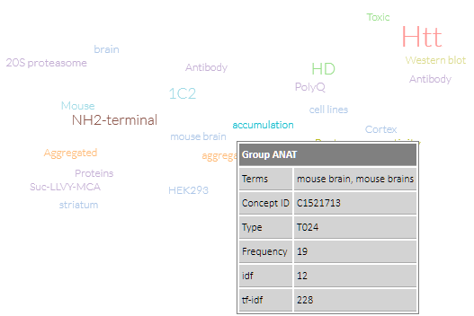

# biotea-vis-annotation
A BioJS component to visualize RDF Biotea annotations, 
see more at https://github.com/biotea/biotea-annotation

There is one **local** dependency to 
https://github.com/ljgarcia/biotea-io-parser. You will need to download it and install it as a node-module for biote-vis-annotation to work.
